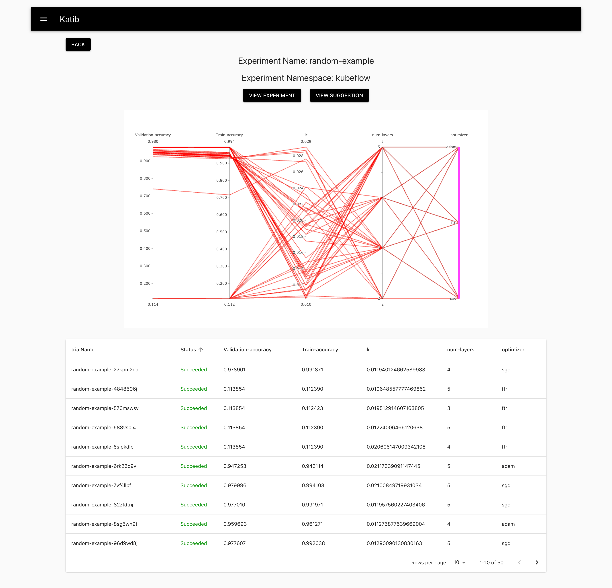

<h1 align="center">
    
  <br>
</h1>

[](https://travis-ci.org/kubeflow/katib)
[](https://coveralls.io/github/kubeflow/katib?branch=master)
[](https://goreportcard.com/report/github.com/kubeflow/katib)

Katib is a Kubernetes-based system for [Hyperparameter Tuning][1] and [Neural Architecture Search][2]. Katib supports a number of ML frameworks, including TensorFlow, Apache MXNet, PyTorch, XGBoost, and others.

Table of Contents
=================

  * [Getting Started](#getting-started)
  * [Name](#name)
  * [Concepts in Katib](#concepts-in-katib)
      * [Experiment](#experiment)
      * [Suggestion](#suggestion)
      * [Trial](#trial)
      * [Worker Job](#worker-job)
  * [Components in Katib](#components-in-katib)
  * [Web UI](#web-ui)
  * [API documentation](#api-documentation)
  * [Installation](#installation)
      * [TF operator](#tf-operator)
      * [PyTorch operator](#pytorch-operator)
      * [Katib](#katib)
      * [Running examples](#running-examples)
      * [Cleanups](#cleanups)
  * [Katib SDK](#katib-sdk)      
  * [Quick Start](#quick-start)
  * [Who are using Katib?](#who-are-using-katib)
  * [Citation](#citation)
  * [CONTRIBUTING](#contributing)

Created by [gh-md-toc](https://github.com/ekalinin/github-markdown-toc)

## Getting Started

See the [getting-started 
guide](https://www.kubeflow.org/docs/components/hyperparameter-tuning/hyperparameter/)
on the Kubeflow website.

## Name

Katib stands for `secretary` in Arabic.

## Concepts in Katib

For a detailed description of the concepts in Katib, hyperparameter tuning, and
neural architecture search, see the [Kubeflow 
documentation](https://www.kubeflow.org/docs/components/hyperparameter-tuning/overview/).

Katib has the concepts of Experiment, Trial, Job and Suggestion.

### Experiment

`Experiment` represents a single optimization run over a feasible space.
Each `Experiment` contains a configuration:

1. Objective: What we are trying to optimize.
2. Search Space: Constraints for configurations describing the feasible space.
3. Search Algorithm: How to find the optimal configurations.

`Experiment` is defined as a CRD. See the detailed guide to [configuring and running a Katib 
experiment](https://kubeflow.org/docs/components/hyperparameter-tuning/experiment/)
in the Kubeflow docs.

### Suggestion

A Suggestion is a proposed solution to the optimization problem which is one set of hyperparameter values or a list of parameter assignments. Then a `Trial` will be created to evaluate the parameter assignments.

`Suggestion` is defined as a CRD.

### Trial

A `Trial` is one iteration of the optimization process, which is one `worker job` instance with a list of parameter assignments(corresponding to a suggestion).

`Trial` is defined as a CRD.

### Worker Job 

A `Worker Job` refers to a process responsible for evaluating a `Trial` and calculating its objective value. 

The worker kind can be [Kubernetes Job](https://kubernetes.io/docs/concepts/workloads/controllers/jobs-run-to-completion/) which is a non distributed execution, [Kubeflow TFJob](https://www.kubeflow.org/docs/guides/components/tftraining/) or [Kubeflow PyTorchJob](https://www.kubeflow.org/docs/guides/components/pytorch/) which are distributed executions.
Thus, Katib supports multiple frameworks with the help of different job kinds. 

Currently Katib supports the following exploration algorithms:

#### Hyperparameter Tuning

* [Random Search](https://en.wikipedia.org/wiki/Hyperparameter_optimization#Random_search)
* [Tree of Parzen Estimators (TPE)](https://papers.nips.cc/paper/4443-algorithms-for-hyper-parameter-optimization.pdf)
* [Grid Search](https://en.wikipedia.org/wiki/Hyperparameter_optimization#Grid_search)
* [Hyperband](https://arxiv.org/pdf/1603.06560.pdf)
* [Bayesian Optimization](https://arxiv.org/pdf/1012.2599.pdf)
* [CMA Evolution Strategy](https://arxiv.org/abs/1604.00772)

#### Neural Architecture Search

* [Efficient Neural Architecture Search (ENAS)](https://github.com/kubeflow/katib/tree/master/pkg/suggestion/v1beta1/nas/enas)
* [Differentiable Architecture Search (DARTS)](https://github.com/kubeflow/katib/tree/master/pkg/suggestion/v1beta1/nas/darts)


## Components in Katib

Katib consists of several components as shown below. Each component is running on k8s as a deployment.
Each component communicates with others via GRPC and the API is defined at `pkg/apis/manager/v1beta1/api.proto`
for v1beta1 version and `pkg/apis/manager/v1alpha3/api.proto` for v1alpha3 version.

- Katib main components:
  - katib-db-manager: GRPC API server of Katib which is the DB Interface.
  - katib-mysql: Data storage backend of Katib using mysql.
  - katib-ui: User interface of Katib.
  - katib-controller: Controller for Katib CRDs in Kubernetes.

## Web UI

Katib provides a Web UI.
You can visualize general trend of Hyper parameter space and each training history. You can use
[random-example](https://github.com/kubeflow/katib/blob/master/examples/v1beta1/random-example.yaml) or
[other examples](https://github.com/kubeflow/katib/blob/master/examples/v1beta1) to generate a similar UI.


## GRPC API documentation

See the [Katib v1beta1 API reference docs](https://github.com/kubeflow/katib/blob/master/pkg/apis/manager/v1beta1/gen-doc/api.md).

See the [Katib v1alpha3 API reference docs](https://www.kubeflow.org/docs/reference/katib/).

## Installation

For standard installation of Katib with support for all job operators, 
install Kubeflow. Current official Katib version in Kubeflow latest release is v1alpha3.
See the documentation:

* [Kubeflow installation 
guide](https://www.kubeflow.org/docs/started/getting-started/)
* [Kubeflow hyperparameter tuning 
guides](https://www.kubeflow.org/docs/components/hyperparameter-tuning/).

If you install Katib with other Kubeflow components, you can't submit Katib jobs in Kubeflow namespace.

Alternatively, if you want to install Katib manually with TF and PyTorch operators support, follow these steps:

Create Kubeflow namespace:

```
kubectl create namespace kubeflow
```

Clone Kubeflow manifest repository:

```
git clone git@github.com:kubeflow/manifests.git
Set `MANIFESTS_DIR` to the cloned folder.
export MANIFESTS_DIR=<cloned-folder>
```

### TF operator

For installing TF operator, run the following:

```
cd "${MANIFESTS_DIR}/tf-training/tf-job-crds/base"
kustomize build . | kubectl apply -f -
cd "${MANIFESTS_DIR}/tf-training/tf-job-operator/base"
kustomize build . | kubectl apply -n kubeflow -f -
```

### PyTorch operator

For installing PyTorch operator, run the following:

```
cd "${MANIFESTS_DIR}/pytorch-job/pytorch-job-crds/base"
kustomize build . | kubectl apply -f -
cd "${MANIFESTS_DIR}/pytorch-job/pytorch-operator/base/"
kustomize build . | kubectl apply -n kubeflow -f -
```

### Katib

Finally, you can install Katib.

For v1beta1 version, run the following:

```
git clone git@github.com:kubeflow/katib.git
bash katib/scripts/v1beta1/deploy.sh
```

For v1alpha3 version, run the following:

```
cd "${MANIFESTS_DIR}/katib/katib-crds/base"
kustomize build . | kubectl apply -f -
cd "${MANIFESTS_DIR}/katib/katib-controller/base"
kustomize build . | kubectl apply -f -

```

If you install Katib from Kubeflow manifest repository and you want to use Katib in a cluster that doesn't have a StorageClass for dynamic volume provisioning, you have to create persistent volume manually to bound your persistent volume claim.

This is sample yaml file for creating a persistent volume with local storage:

```yaml
apiVersion: v1
kind: PersistentVolume
metadata:
  name: katib-mysql
  labels:
    type: local
    app: katib
spec:
  storageClassName: katib
  capacity:
    storage: 10Gi
  accessModes:
    - ReadWriteOnce
  hostPath:
    path: /tmp/katib
```

Create this PV after deploying Katib package

Check if all components are running successfully:

```
kubectl get pods -n kubeflow
```

Expected output:

```
NAME                                READY   STATUS    RESTARTS   AGE
katib-controller-858d6cc48c-df9jc   1/1     Running   1          20m
katib-db-manager-7966fbdf9b-w2tn8   1/1     Running   0          20m
katib-mysql-7f8bc6956f-898f9        1/1     Running   0          20m
katib-ui-7cf9f967bf-nm72p           1/1     Running   0          20m
pytorch-operator-55f966b548-9gq9v   1/1     Running   0          20m
tf-job-operator-796b4747d8-4fh82    1/1     Running   0          21m
```

### Running examples

After deploy everything, you can run examples to verify the installation.
Examples bellow are for v1beta1 version.

This is example for TF operator:

```
kubectl create -f https://raw.githubusercontent.com/kubeflow/katib/master/examples/v1beta1/tfjob-example.yaml
```

This is example for PyTorch operator:

```
kubectl create -f https://raw.githubusercontent.com/kubeflow/katib/master/examples/v1beta1/pytorchjob-example.yaml
```

You can check status of experiment 

```yaml
$ kubectl describe experiment tfjob-example -n kubeflow

Name:         tfjob-example
Namespace:    kubeflow
Labels:       <none>
Annotations:  <none>
API Version:  kubeflow.org/v1beta1
Kind:         Experiment
Metadata:
  Creation Timestamp:  2020-07-15T14:27:53Z
  Finalizers:
    update-prometheus-metrics
  Generation:        1
  Resource Version:  100380029
  Self Link:         /apis/kubeflow.org/v1beta1/namespaces/kubeflow/experiments/tfjob-example
  UID:               5e3cf1f5-c6a7-11ea-90dd-42010a9a0020
Spec:
  Algorithm:
    Algorithm Name:        random
  Max Failed Trial Count:  3
  Max Trial Count:         12
  Metrics Collector Spec:
    Collector:
      Kind:  TensorFlowEvent
    Source:
      File System Path:
        Kind:  Directory
        Path:  /train
  Objective:
    Goal:  0.99
    Metric Strategies:
      Name:                 accuracy_1
      Value:                max
    Objective Metric Name:  accuracy_1
    Type:                   maximize
  Parallel Trial Count:     3
  Parameters:
    Feasible Space:
      Max:           0.05
      Min:           0.01
    Name:            learning_rate
    Parameter Type:  double
    Feasible Space:
      Max:           200
      Min:           100
    Name:            batch_size
    Parameter Type:  int
  Resume Policy:     LongRunning
  Trial Template:
    Trial Parameters:
      Description:  Learning rate for the training model
      Name:         learningRate
      Reference:    learning_rate
      Description:  Batch Size
      Name:         batchSize
      Reference:    batch_size
    Trial Spec:
      API Version:  kubeflow.org/v1
      Kind:         TFJob
      Spec:
        Tf Replica Specs:
          Worker:
            Replicas:        2
            Restart Policy:  OnFailure
            Template:
              Spec:
                Containers:
                  Command:
                    python
                    /var/tf_mnist/mnist_with_summaries.py
                    --log_dir=/train/metrics
                    --learning_rate=${trialParameters.learningRate}
                    --batch_size=${trialParameters.batchSize}
                  Image:              gcr.io/kubeflow-ci/tf-mnist-with-summaries:1.0
                  Image Pull Policy:  Always
                  Name:               tensorflow
Status:
  Completion Time:  2020-07-15T14:30:52Z
  Conditions:
    Last Transition Time:  2020-07-15T14:27:53Z
    Last Update Time:      2020-07-15T14:27:53Z
    Message:               Experiment is created
    Reason:                ExperimentCreated
    Status:                True
    Type:                  Created
    Last Transition Time:  2020-07-15T14:30:52Z
    Last Update Time:      2020-07-15T14:30:52Z
    Message:               Experiment is running
    Reason:                ExperimentRunning
    Status:                False
    Type:                  Running
    Last Transition Time:  2020-07-15T14:30:52Z
    Last Update Time:      2020-07-15T14:30:52Z
    Message:               Experiment has succeeded because Objective goal has reached
    Reason:                ExperimentGoalReached
    Status:                True
    Type:                  Succeeded
  Current Optimal Trial:
    Best Trial Name:  tfjob-example-gjxn54vl
    Observation:
      Metrics:
        Latest:  0.966300010681
        Max:     1.0
        Min:     0.103260867298
        Name:    accuracy_1
    Parameter Assignments:
      Name:    learning_rate
      Value:   0.015945204040626416
      Name:    batch_size
      Value:   184
  Start Time:  2020-07-15T14:27:53Z
  Succeeded Trial List:
    tfjob-example-5jd8nnjg
    tfjob-example-bgjfpd5t
    tfjob-example-gjxn54vl
    tfjob-example-vpdqxkch
    tfjob-example-wvptx7gt
  Trials:            5
  Trials Succeeded:  5
Events:              <none>
```

When the spec.Status.Condition becomes ```Succeeded```, the experiment is finished.

You can monitor your results in Katib UI. 
Access Katib UI via Kubeflow dashboard if you have used standard installation or port-forward the `katib-ui` service if you have installed manually.

```
kubectl -n kubeflow port-forward svc/katib-ui 8080:80
```

You can access the Katib UI using this URL: ```http://localhost:8080/katib/```.

### Katib SDK

Katib supports Python SDK for v1beta1 and v1alpha3 version.

* See the [Katib v1beta1 SDK documentation](https://github.com/kubeflow/katib/tree/master/sdk/python/v1beta1).

* See the [Katib v1alpha3 SDK documentation](https://github.com/kubeflow/katib/tree/master/sdk/python/v1alpha3).

Run [`gen_sdk.sh`](https://github.com/kubeflow/katib/blob/master/hack/gen-python-sdk/gen_sdk.sh) to update SDK.

### Cleanups

To delete installed TF and PyTorch operator run `kubectl delete -f` on the respective folders. 

To delete Katib for v1beta1 version run `bash katib/scripts/v1beta1/undeploy.sh`.

## Quick Start

Please see [Quick Start Guide](./docs/quick-start.md).

## Who are using Katib?

Please see [adopters.md](./docs/community/adopters.md).

## CONTRIBUTING

Please feel free to test the system! [developer-guide.md](./docs/developer-guide.md) is a good starting point for developers.

[1]: https://en.wikipedia.org/wiki/Hyperparameter_optimization
[2]: https://en.wikipedia.org/wiki/Neural_architecture_search
[3]: https://static.googleusercontent.com/media/research.google.com/ja//pubs/archive/bcb15507f4b52991a0783013df4222240e942381.pdf

## Citation

If you use Katib in a scientific publication, we would appreciate
citations to the following paper:

[A Scalable and Cloud-Native Hyperparameter Tuning System](https://arxiv.org/abs/2006.02085), George *et al.*, arXiv:2006.02085, 2020.

Bibtex entry:

```
@misc{george2020katib,
    title={A Scalable and Cloud-Native Hyperparameter Tuning System},
    author={Johnu George and Ce Gao and Richard Liu and Hou Gang Liu and Yuan Tang and Ramdoot Pydipaty and Amit Kumar Saha},
    year={2020},
    eprint={2006.02085},
    archivePrefix={arXiv},
    primaryClass={cs.DC}
}
```
