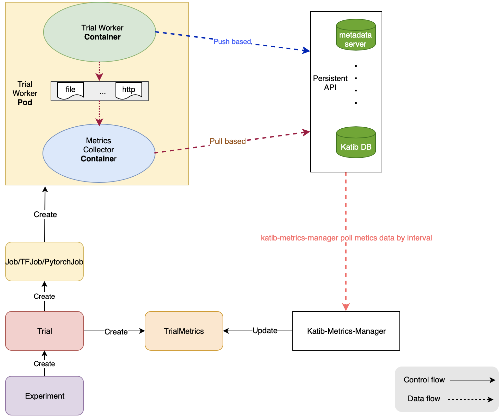

# KEP-685: Metrics Collector Proposal

- [Metrics Collector Proposal](#metrics-collector-proposal)
  - [Links](#links)
  - [Motivation](#motivation)
  - [Goal](#goal)
  - [API](#api)
    - [Metric Collector](#metric-collector)
  - [Implementation](#implementation)
    - [Mutating Webhook](#mutating-webhook)
    - [Metric Collector](#metric-collector-1)
    - [Collection of Final Metrics](#collection-of-final-metrics)

## Links

- [katib/issues#685 (Katib metrics collector solution)](https://github.com/kubeflow/katib/issues/685)
- [katib/pull#697 (API for metricCollector)](https://github.com/kubeflow/katib/pull/697#issuecomment-516264282)
- [katib/pull#716 (Add pod level inject webhook)](https://github.com/kubeflow/katib/pull/716)
- [katib/pull#729 (Inject pod sidecar for specified namespace)](https://github.com/kubeflow/katib/pull/729)
- [katib/pull#730 (fix: Add build for sidecar)](https://github.com/kubeflow/katib/pull/730)

## Motivation

[Katib](https://github.com/kubeflow/katib) is a hyperparameter tuning (HPT) and neural architecture search (NAS) system based on Kubernetes.
During the auto-training, the metrics collection is an essential step.
In the current design, the metrics collector is pulled-based.
Katib runs a metrics collector cron job for each Trial.
The cron job pulls the targeted pod logs periodically and then persist the logs into MySQL.
However, the pulled-based design has [some problems](https://github.com/kubeflow/tf-operator/issues/722#issuecomment-405669269), such as, at what frequency should we scrape the metrics and so on.

To enhance the extensibility and support EarlyStopping, we propose a new design of the metrics collector.
In the new design, Katib use mutating webhook to inject metrics collector container as a sidecar into Job/Tfjob/PytorchJob pod.
The sidecar collects metrics of the master and then store them on the persistent layer (e.x. katib-db-manager and metadata server).

Fig. 1 Architecture of the new design

## Goal

1. **A mutating webhook**: inject metrics collector as a sidecar into master pod.
2. **A metric collector**: collect metrics and store them on the persistent layer (katib-db-manager).
3. **The final metrics** of worker pods should be collected by trail controller and then be stored into trial status.

## API

### Metric Collector

For more detail, see [here](https://github.com/kubeflow/katib/pull/697#issuecomment-516264282).

    type MetricsCollectorSpec struct {
        Retain     bool       `json:"retain,omitempty"`
        // Deprecated Retain
        Retain bool `json:"retain,omitempty"`
        // Deprecated GoTemplate
        GoTemplate GoTemplate `json:"goTemplate,omitempty"`

        Source    *SourceSpec    `json:"source,omitempty"`
        Collector *CollectorSpec `json:"collector,omitempty"`
    }

    type SourceSpec struct {
        // Model-train source code can expose metrics by http, such as HTTP endpoint in
        // prometheus metric format
        HttpGet *v1.HTTPGetAction `json:"httpGet,omitempty"`
        // During training model, metrics may be persisted into local file in source
        // code, such as tfEvent use case
        FileSystemPath *FileSystemPath `json:"fileSystemPath,omitempty"`
        // Default metric output format is {"metric": "<metric_name>",
        // "value": <int_or_float>, "epoch": <int>, "step": <int>}, but if the output doesn't
        // follow default format, please extend it here
        Filter *FilterSpec `json:"filter,omitempty"`
        }

    type FilterSpec struct {
        // When the metrics output follows format as this field specified, metricsCollector
        // collects it and reports to metrics server, it can be "<metric_name>: <float>" or else
        MetricsFormat []string `json:"metricsFormat,omitempty"`
    }

    type FileSystemKind string

    const (
        DirectoryKind FileSystemKind = "diretory"
        FileKind      FileSystemKind = "file"
    )

    type FileSystemPath struct {
        Path string         `json:"path,omitempty"`
        Kind FileSystemKind `json:"kind,omitempty"`
    }

    type CollectorKind string

    const (
        StdOutCollector           CollectorKind = "stdOutCollector"
        FileCollector             CollectorKind = "fileCollector"
        TfEventCollector          CollectorKind = "tfEventCollector"
        PrometheusMetricCollector CollectorKind = "prometheusMetricCollector"
        CustomCollector           CollectorKind = "customCollector"
        // When model training source code persists metrics into persistent layer
        // directly, metricsCollector isn't in need, and its kind is "noneCollector"
        NoneCollector CollectorKind = "noneCollector"
    )

    type CollectorSpec struct {
        Kind CollectorKind `json:"kind"`
        // When kind is "customCollector", this field will be used
        CustomCollector *v1.Container `json:"customCollector,omitempty"`
    }

## Implementation

### Mutating Webhook

To avoid collecting duplicated metrics, as we discuss in [kubeflow/katib#685](https://github.com/kubeflow/katib/issues/685), only one metrics collector sidecar will be injected into the master pod during one Experiment.
In the new design, there are two modes for Katib mutating webhook to inject the sidecar: **Pod Level Injecting** and **Job Level Injecting**.
The webhook decides which mode to be used based on the `katib.kubeflow.org/metrics-collector-injection=enabled` label tagged on the namespace.
In the namespace with `katib.kubeflow.org/metrics-collector-injection=enabled` label, the webhook inject the sidecar in the pod level. Otherwise, without this label, injecting in the job level.

In **Pod Level Injecting**,

1. Job operators (_e.x. TFjob/PyTorchjob_) tag the `training.kubeflow.org/job-role: master` ([#1064](https://github.com/kubeflow/tf-operator/pull/1064)) label on the master pod.
2. The webhook inject the metric collector only if the webhook recognizes this label.
3. The webhook uses [ObjectSelector](https://github.com/kubernetes/kubernetes/pull/78505) to skip on irrelevant objects in order to optimize the performance.
4. ObjectSelector is only supported above _Kubernetes v1.15_. Without this new feature, there may be a [performance issue](https://github.com/kubeflow/katib/issues/685#issuecomment-516226070) in webhook. In this situation, the following **Job Level Injecting** mode may be a better option.

In **Job Level Injecting**,

1. The webhook use different strategies to inject sidecar according to different job operators. For now, the webhook support PytorchJob and TfJob.
2. For PytorchJob, the metrics collector sidecar is injected into master template.
3. For TfJob, the metrics collector sidecar is injected into master template if master exists. Otherwise, the sidecar is injected into worker template with 0 index.

After injecting, the sidecar collects metrics of the master and then store them on the persistent layer (e.x. katib-db-manager and metadata server).

### Metric Collector

In [katib/pull#716](https://github.com/kubeflow/katib/pull/716), we implement a mutating webhook and a new [sidecarmetricscollector](https://github.com/kubeflow/katib/pull/716/files?file-filters%5B%5D=.go#diff-94d1b936fc88df26ddebf78ccc45805d) which differ from the original metrics collector.
The mutating webhook inject a sidecar metrics collector into every master pod.

While running as a sidecar, the collector container needs to keep running to make sure the master pod does training normally.
Otherwise, if the sidecar container is completed or error before the master container finishes, this master pod with sidecar will be invisible to other worker pods.
Therefore, in the implementation, the sidecar collector collects the logs from the Kubernetes client in the `Follow` mode and keep on retrying while error encountered.

### Collection of Final Metrics

The final metrics of worker pods should be collected by trail controller and then be stored into trial status.

_#WIP_
