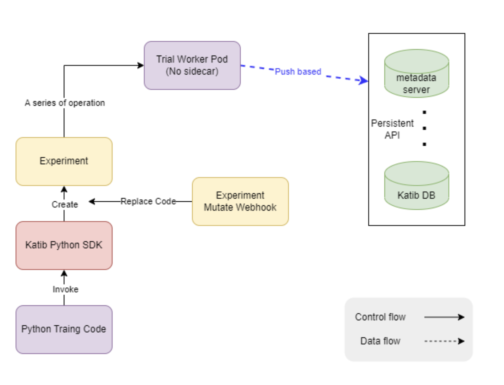

# Push-based Metrics Collection Proposal

## Links

- [katib/issues#577([Enhancement Request] Metrics Collector Push-based Implementation)](https://github.com/kubeflow/katib/issues/577)

## Motivation

[Katib](https://github.com/kubeflow/katib) is a Kubernetes-native project for automated machine learning (AutoML). It can not only tune hyperparameters of applications written in any language and natively supports many ML frameworks, but also supports features like early stopping and neural architecture search.

In the procedure of tuning hyperparameters, Metrics Collector, which is implemented as a sidecar container attached to each training container in the [current design](https://github.com/kubeflow/katib/blob/master/docs/proposals/metrics-collector.md), will collect training logs from Trials once the training is complete. Then, the Metrics Collector will parse training logs to get appropriate metrics like accuracy or loss and pass the evaluation results to the HyperParameter tuning algorithm.

However, current implementation of Metrics Collector is pull-based, raising some [design problems](https://github.com/kubeflow/training-operator/issues/722#issuecomment-405669269) such as determining the frequency we scrape the metrics, performance issues like the overhead caused by too many sidecar containers, and restrictions on developing environments which must support sidecar containers. Thus, we should implement a new API for Katib Python SDK to offer users a push-based way to store metrics directly into the Kaitb DB and resolve those issues raised by pull-based metrics collection.

Fig.1 Architecture of the new design

## Goal
1. **A new parameter in Python SDK function `tune`**: allow users to specify the method of collecting metrics(push-based/pull-based).
2. **A code injection function in mutating webhook**: recognize the metrics output lines and replace them with push-based metrics collection code.
3. The final metrics of worker pods should be **pushed to Katib DB directly** in the push mode of metrics collection.

## API

### New parameter in Python SDK function `tune`

          