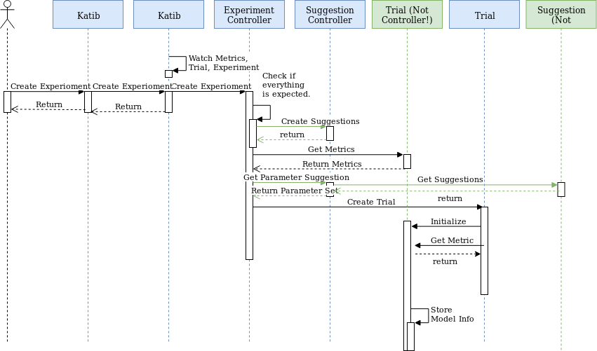

# Suggestion CRD Design Proposal

Table of Contents
=================

   * [Suggestion CRD Design Proposal](#suggestion-crd-design-proposal)
   * [Table of Contents](#table-of-contents)
      * [Background](#background)
      * [Goals](#goals)
      * [Non-Goals](#non-goals)
      * [Design](#design)
         * [Kubernetes API](#kubernetes-api)
         * [GRPC API](#grpc-api)
         * [Workflow](#workflow)
            * [Example](#example)

Created by [gh-md-toc](https://github.com/ekalinin/github-markdown-toc)

## Background

## Goals

## Non-Goals

## Design

### Kubernetes API

```go
type SuggestionSpec struct {
	//Name of the algorithm
	AlgorithmName string `json:"algorithm_name"`

	// Number of suggestions requested
	Suggestions int `json:"suggestions"`

	//Algorithm settings set by the user in the experiment config
	AlgorithmSettings []AlgorithmSetting `json:"algorithm_settings,omitempty"`
}

type AlgorithmSetting struct {
	Name  string `json:"name,omitempty"`
	Value string `json:"value,omitempty"`
}

type SuggestionStatus struct {
	// Suggestion results
	Assignments []TrialAssignment `json:"assignments,omitempty"`

	Conditions []SuggestionCondition `json:"conditions,omitempty"`
	// include all common fields

}

type TrialAssignment struct {
	// Suggestion results
	Assignments []ParameterAssignment `json:"assignments,omitempty"`
	Name        string                `json:"name,omitempty"`
}

type ParameterAssignment struct {
	Name  string `json:"name,omitempty"`
	Value string `json:"value,omitempty"`
}

type Suggestion struct {
	metav1.TypeMeta   `json:",inline"`
	metav1.ObjectMeta `json:"metadata,omitempty"`

	Spec   SuggestionSpec   `json:"spec,omitempty"`
	Status SuggestionStatus `json:"status,omitempty"`
}
```

### GRPC API

```protobuf
syntax = "proto3";

package api.v1.alpha3;

import "google/api/annotations.proto";

service Suggestion {
    rpc GetSuggestions(GetSuggestionsRequest) returns (GetSuggestionsReply);
}

message GetSuggestionsRequest {
    Experiment experiment = 1;
    repeated Trial trials = 2; // all completed trials owned by the experiment.
    int32 request_number = 3;
}

message GetSuggestionsReply {
    repeated Trial trials = 1; // trials should be created in the next run.
    AlgorithmSpec algorithm = 2;
}

message Experiment {
    string name = 1;
    ExperimentSpec experiment_spec = 2;
}

message ExperimentSpec {
   AlgorithmSpec algorithm = 3;
   ParameterSpecs parameter_specs = 1;
   ObjectiveSpec objective = 2;
}

message ParameterSpecs {
    repeated ParameterSpec parameters = 1; 
}

message AlgorithmSpec {
    string algorithm_name = 1;
    repeated AlgorithmSetting algorithm_setting = 2;
}

message AlgorithmSetting {
    string name = 1;
    string value = 2;
}

message ParameterSpec {
    string name = 1; /// Name of the parameter.
    ParameterType parameter_type = 2; /// Type of the parameter.
    FeasibleSpace feasible_space = 3; /// FeasibleSpace for the parameter.
}

message FeasibleSpace {
    string max = 1; /// Max Value
    string min = 2; /// Minimum Value
    repeated string list = 3; /// List of Values.
    string step = 4; /// Step for double or int parameter
}

enum ParameterType {
    UNKNOWN_TYPE = 0; /// Undefined type and not used.
    DOUBLE = 1; /// Double float type. Use "Max/Min".
    INT = 2; /// Int type. Use "Max/Min".
    DISCRETE = 3; /// Discrete number type. Use "List" as float.
    CATEGORICAL = 4; /// Categorical type. Use "List" as string.
}

enum ObjectiveType {
    UNKNOWN = 0; /// Undefined type and not used.
    MINIMIZE = 1; /// Minimize
    MAXIMIZE = 2; /// Maximize
}

message ObjectiveSpec {
    ObjectiveType type = 1;
    double goal = 2;
    string objective_metric_name = 3;
}

message Trial {
   string name = 1;
   TrialSpec spec = 2;
   TrialStatus status = 3;
}

message TrialSpec {
   ParameterAssignments parameter_assignments = 2;
   string run_spec = 3;
}

message ParameterAssignments {
    repeated ParameterAssignment assignments = 1;
}

message ParameterAssignment {
    string name = 1;
    string value = 2;
}

message TrialStatus {
   Observation observation = 4; // The best observation in logs.
}

message Observation {
    repeated Metric metrics = 1;
}

message Metric {
    string name = 1;
    string value = 2;
}
```

### Workflow



When the user creates a Experiment, we will create a Suggestion for the Experiment. When the Experiment needs some suggestions, Experiment controller updates the `Suggestions`, then Suggestion controller communicates with the Suggestion to get parameter assignments and set them in Suggestion status.

#### Example

Now the workflow will be illustrated with an example.

```yaml
apiVersion: "kubeflow.org/v1alpha2"
kind: Experiment
metadata:
  namespace: kubeflow
  name: random-experiment
spec:
  parallelTrialCount: 3
  maxTrialCount: 12
  maxFailedTrialCount: 3
  objective:
    type: maximize
    goal: 0.99
    objectiveMetricName: Validation-accuracy
    additionalMetricNames:
      - accuracy
  algorithm:
    algorithmName: random
  trialTemplate:
    goTemplate:
        rawTemplate: |-
          apiVersion: batch/v1
          kind: Job
          metadata:
            name: {{.Trial}}
            namespace: {{.NameSpace}}
          spec:
            template:
              spec:
                containers:
                - name: {{.Trial}}
                  image: katib/mxnet-mnist-example
                  command:
                  - "python"
                  - "/mxnet/example/image-classification/train_mnist.py"
                  - "--batch-size=64"
                  {{- with .HyperParameters}}
                  {{- range .}}
                  - "{{.Name}}={{.Value}}"
                  {{- end}}
                  {{- end}}
                restartPolicy: Never
  parameters:
    - name: --lr
      parameterType: double
      feasibleSpace:
        min: "0.01"
        max: "0.03"
    - name: --num-layers
      parameterType: int
      feasibleSpace:
        min: "2"
        max: "5"
    - name: --optimizer
      parameterType: categorical
      feasibleSpace:
        list:
        - sgd
        - adam
        - ftrl
```

Now, we will create a Suggestion for the Experiment:

```yaml
apiVersion: "kubeflow.org/v1alpha2"
kind: Suggestion
metadata:
  namespace: kubeflow
  name: random-experiment
spec:
  algorithmName: random
  suggestions: 0
```

Then, Experiment controller needs 3 parallel trials to run. It updates the Suggestions:

```yaml
apiVersion: "kubeflow.org/v1alpha2"
kind: Suggestion
metadata:
  namespace: kubeflow
  name: random-experiment
spec:
  algorithmName: random
  suggestions: 3
```

After that, Suggestion controller communicates with the Suggestion via GRPC and updates the status:

```yaml
apiVersion: "kubeflow.org/v1alpha2"
kind: Suggestion
metadata:
  namespace: kubeflow
  name: random-experiment
spec:
  algorithmName: random
  suggestions: 3
status:
  assignments:
    - assignments:
        - name: --lr
          value: 0.02
        - name: --num-layers
          value: 4
        - name: --optimizer
          value: sgd
    - assignments:
        - name: --lr
          value: 0.021
        - name: --num-layers
          value: 3
        - name: --optimizer
          value: adam
    - assignments:
        - name: --lr
          value: 0.03
        - name: --num-layers
          value: 5
        - name: --optimizer
          value: adam
```

Then Experiment controller creates the trials and set Suggestion status (Optional, not decided):

```yaml
apiVersion: "kubeflow.org/v1alpha2"
kind: Suggestion
metadata:
  namespace: kubeflow
  name: random-experiment
spec:
  algorithmName: random
  suggestions: 3
status:
  assignments:
    - name: random-experiment-fsa2f
      assignments:
        - name: --lr
          value: 0.02
        - name: --num-layers
          value: 4
        - name: --optimizer
          value: sgd
    - name: random-experiment-hoj53
      assignments:
        - name: --lr
          value: 0.021
        - name: --num-layers
          value: 3
        - name: --optimizer
          value: adam
    - name: random-experiment-12lkj
      assignments:
        - name: --lr
          value: 0.03
        - name: --num-layers
          value: 5
        - name: --optimizer
          value: adam
```

When there is one trial finished, Experiment controller will ask Suggestion controller for a new suggestion:

```yaml
apiVersion: "kubeflow.org/v1alpha2"
kind: Suggestion
metadata:
  namespace: kubeflow
  name: random-experiment
spec:
  algorithmName: random
  suggestions: 4
status:
  assignments:
    - name: random-experiment-fsa2f
      assignments:
        - name: --lr
          value: 0.02
        - name: --num-layers
          value: 4
        - name: --optimizer
          value: sgd
    - name: random-experiment-hoj53
      assignments:
        - name: --lr
          value: 0.021
        - name: --num-layers
          value: 3
        - name: --optimizer
          value: adam
    - name: random-experiment-12lkj
      assignments:
        - name: --lr
          value: 0.03
        - name: --num-layers
          value: 5
        - name: --optimizer
          value: adam
    - name: random-experiment-ybfd3
      assignments:
        - name: --lr
          value: 0.012
        - name: --num-layers
          value: 4
        - name: --optimizer
          value: adam
```

## Algorithm Supports

### Grid

We can use the length of the trials to know which grid we are in. Please refer to the [implementation in advisor](https://github.com/tobegit3hub/advisor/blob/master/advisor_server/suggestion/algorithm/grid_search.py).

### Bayes Optimization

We can use skopt or the native implementation in katib to run bayes optimization.

### Hyperband