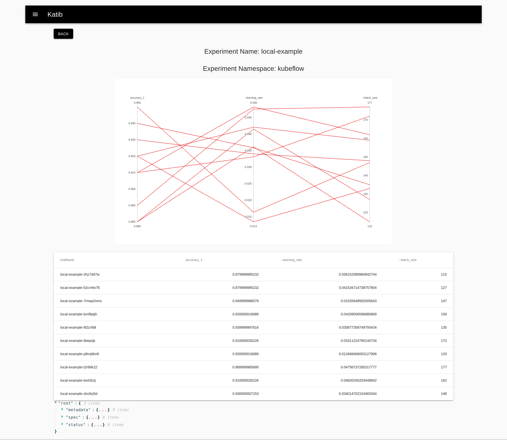
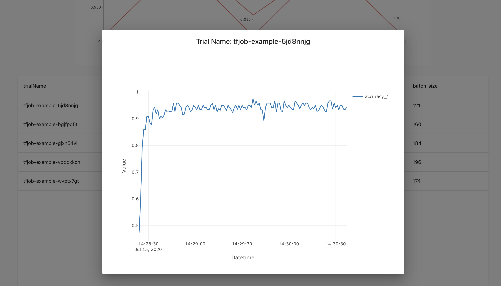

# Quick Start

Katib is a Kubernetes Native System for [Hyperparameter Tuning][1] and [Neural Architecture Search][2]. This short introduction illustrates how to use Katib to:

- Define a hyperparameter tuning experiment.
- Evaluate it using the resources in Kubernetes.
- Get the best hyperparameter combination in all these trials.

## Requirements

Before you run the hyperparameter tuning experiment, you need to have:

- A Kubernetes cluster with Kubeflow 0.7

## Katib in Kubeflow

See the following guides in the Kubeflow documentation:

* [Concepts](https://www.kubeflow.org/docs/components/hyperparameter-tuning/overview/) 
  in Katib, hyperparameter tuning, and neural architecture search.
* [Getting started with Katib](https://kubeflow.org/docs/components/hyperparameter-tuning/hyperparameter/).
* Detailed guide to [configuring and running a Katib 
  experiment](https://kubeflow.org/docs/components/hyperparameter-tuning/experiment/).

## Hyperparameter Tuning on MNIST

Katib supports multiple [Machine Learning Frameworks](https://en.wikipedia.org/wiki/Comparison_of_deep-learning_software) (e.g. TensorFlow, PyTorch, MXNet, and XGBoost).

In this quick start guide, we demonstrate how to use TensorFlow in Katib, which is one of the most popular framework among the world, to run a hyperparameter tuning job on MNIST.

### Package Training Code

The first thing we need to do is to package the training code to a docker image. We use the [example code](../examples/v1alpha3/mnist-tensorflow/mnist_with_summaries.py), which builds a simple neural network, to train on MNIST. The code trains the network and outputs the TFEvents to `/tmp` by default.

You can use our prebuilt image `gcr.io/kubeflow-ci/tf-mnist-with-summaries:1.0`. Thus we can skip it.

### Create the Experiment

If you want to use Katib to automatically tune hyperparameters, you need to define the `Experiment`, which is a CRD that represents a single optimization run over a feasible space. Each `Experiment` contains:

1. Configuration about parallelism: The configuration about the parallelism.
1. Objective: The metric that we want to optimize.
1. Search space: The name and the distribution (discrete valued or continuous valued) of all the hyperparameters you need to search.
1. Search algorithm: The algorithm (e.g. Random Search, Grid Search, TPE, Bayesian Optimization) used to find the best hyperparameters.
1. Trial Template: The template used to define the trial.
1. Metrics Collection: Definition about how to collect the metrics (e.g. accuracy, loss).

The `Experiment`'s definition is defined here:

<details>
  <summary>Click here to get YAML configuration</summary>

```yaml
apiVersion: "kubeflow.org/v1alpha3"
kind: Experiment
metadata:
  namespace: kubeflow
  name: tfjob-example
spec:
  parallelTrialCount: 3
  maxTrialCount: 12
  maxFailedTrialCount: 3
  objective:
    type: maximize
    goal: 0.99
    objectiveMetricName: accuracy_1
  algorithm:
    algorithmName: random
  metricsCollectorSpec:
    source:
      fileSystemPath:
        path: /train
        kind: Directory
    collector:
      kind: TensorFlowEvent
  parameters:
    - name: --learning_rate
      parameterType: double
      feasibleSpace:
        min: "0.01"
        max: "0.05"
    - name: --batch_size
      parameterType: int
      feasibleSpace:
        min: "100"
        max: "200"
  trialTemplate:
    goTemplate:
        rawTemplate: |-
          apiVersion: "kubeflow.org/v1"
          kind: TFJob
          metadata:
            name: {{.Trial}}
            namespace: {{.NameSpace}}
          spec:
           tfReplicaSpecs:
            Worker:
              replicas: 1 
              restartPolicy: OnFailure
              template:
                spec:
                  containers:
                    - name: tensorflow 
                      image: gcr.io/kubeflow-ci/tf-mnist-with-summaries:1.0
                      imagePullPolicy: Always
                      command:
                        - "python"
                        - "/var/tf_mnist/mnist_with_summaries.py"
                        - "--log_dir=/train/metrics"
                        {{- with .HyperParameters}}
                        {{- range .}}
                        - "{{.Name}}={{.Value}}"
                        {{- end}}
                        {{- end}}
```

The experiment has two hyperparameters defined in `parameters`： `--learning_rate` and `--batch_size`. We decide to use random search algorithm, and collect metrics from the TF Events.

</details>

Or you could just run:

```bash
kubectl apply -f ./examples/v1alpha3/tfjob-example.yaml
```

### Get trial results

You can get the trial results using the command (Need to install [`jq`](https://stedolan.github.io/jq/download/) to parse JSON):

```bash
kubectl -n kubeflow get trials -o json | jq ".items[] | {assignments: .spec.parameterAssignments, observation: .status.observation}"
```

You should get the output:

```json
{
  "assignments": [
    {
      "name": "--learning_rate",
      "value": "0.02722446089467028"
    },
    {
      "name": "--batch_size",
      "value": "115"
    }
  ],
  "observation": {
      "metrics": [
          {
            "name": "accuracy_1",
            "value": "0.987",
          },
      ],
  },
}
```

Or you could get the result in UI: `<Katib-URL>/katib/#/katib/hp_monitor/kubeflow/quick-start-example`.



When you click the trial name, you should get the details about metrics:



<!-- ## Hyperparameter Tuning with Distributed Training on MNIST -->

[1]: https://en.wikipedia.org/wiki/Hyperparameter_optimization
[2]: https://en.wikipedia.org/wiki/Neural_architecture_search