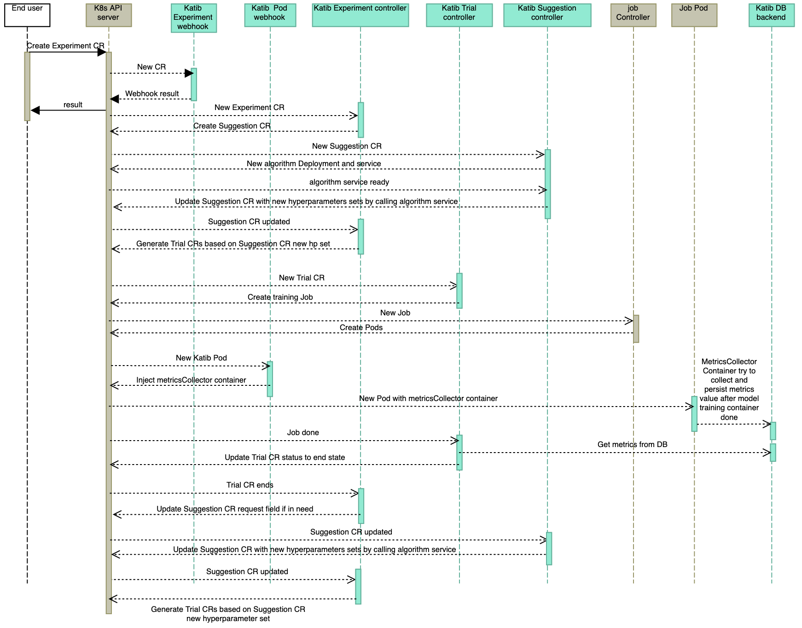

# How Katib v1beta1 tunes hyperparameters automatically in a Kubernetes native way

Follow the Kubeflow documentation guides:

- [Concepts](https://www.kubeflow.org/docs/components/katib/overview/)
  in Katib, hyperparameter tuning, and neural architecture search.
- [Getting started with Katib](https://kubeflow.org/docs/components/katib/hyperparameter/).
- Detailed guide to
  [configuring and running a Katib `Experiment`](https://kubeflow.org/docs/components/katib/experiment/).

## Example and Illustration

After install Katib v1beta1, you can try the first Katib Experiment:

```
kubectl apply -f https://raw.githubusercontent.com/kubeflow/katib/master/examples/v1beta1/hp-tuning/random.yaml
```

### Experiment

When you want to tune hyperparameters for your machine learning model before
training it further, you just need to create an `Experiment` CR. To
learn what fields are included in the `Experiment.spec`, follow
the detailed guide to
[configuring and running a Katib `Experiment`](https://kubeflow.org/docs/components/katib/experiment/).
Then you can get the new `Experiment` as below.
Katib concepts are introduced based on this example.

```yaml
$ kubectl get experiment random -n kubeflow -o yaml

apiVersion: kubeflow.org/v1beta1
kind: Experiment
metadata:
  ...
  name: random
  namespace: kubeflow
  ...
spec:
  algorithm:
    algorithmName: random
  maxFailedTrialCount: 3
  maxTrialCount: 12
  metricsCollectorSpec:
    collector:
      kind: StdOut
  objective:
    additionalMetricNames:
    - Train-accuracy
    goal: 0.99
    metricStrategies:
    - name: Validation-accuracy
      value: max
    - name: Train-accuracy
      value: max
    objectiveMetricName: Validation-accuracy
    type: maximize
  parallelTrialCount: 3
  parameters:
  - feasibleSpace:
      max: "0.03"
      min: "0.01"
    name: lr
    parameterType: double
  - feasibleSpace:
      max: "5"
      min: "2"
    name: num-layers
    parameterType: int
  - feasibleSpace:
      list:
      - sgd
      - adam
      - ftrl
    name: optimizer
    parameterType: categorical
  resumePolicy: Never
  trialTemplate:
    failureCondition: status.conditions.#(type=="Failed")#|#(status=="True")#
    primaryContainerName: training-container
    successCondition: status.conditions.#(type=="Complete")#|#(status=="True")#
    trialParameters:
    - description: Learning rate for the training model
      name: learningRate
      reference: lr
    - description: Number of training model layers
      name: numberLayers
      reference: num-layers
    - description: Training model optimizer (sdg, adam or ftrl)
      name: optimizer
      reference: optimizer
    trialSpec:
      apiVersion: batch/v1
      kind: Job
      spec:
        template:
          spec:
            containers:
            - command:
              - python3
              - /opt/mxnet-mnist/mnist.py
              - --batch-size=64
              - --lr=${trialParameters.learningRate}
              - --num-layers=${trialParameters.numberLayers}
              - --optimizer=${trialParameters.optimizer}
              image: docker.io/kubeflowkatib/mxnet-mnist:v1beta1-45c5727
              name: training-container
            restartPolicy: Never
status:
  completionTime: "2021-10-01T21:47:35Z"
  conditions:
  - lastTransitionTime: "2021-10-01T21:27:46Z"
    lastUpdateTime: "2021-10-01T21:27:46Z"
    message: Experiment is created
    reason: ExperimentCreated
    status: "True"
    type: Created
  - lastTransitionTime: "2021-10-01T21:47:35Z"
    lastUpdateTime: "2021-10-01T21:47:35Z"
    message: Experiment is running
    reason: ExperimentRunning
    status: "False"
    type: Running
  - lastTransitionTime: "2021-10-01T21:47:35Z"
    lastUpdateTime: "2021-10-01T21:47:35Z"
    message: Experiment has succeeded because max trial count has reached
    reason: ExperimentMaxTrialsReached
    status: "True"
    type: Succeeded
  currentOptimalTrial:
    bestTrialName: random-gh8psfcz
    observation:
      metrics:
      - latest: "0.977707"
        max: "0.979299"
        min: "0.955215"
        name: Validation-accuracy
      - latest: "0.993570"
        max: "0.993570"
        min: "0.907932"
        name: Train-accuracy
    parameterAssignments:
    - name: lr
      value: "0.014431754535687558"
    - name: num-layers
      value: "3"
    - name: optimizer
      value: sgd
  startTime: "2021-10-01T21:27:46Z"
  succeededTrialList:
  - random-ghvj6q8z
  - random-4z4kqr5l
  - random-8ssrzrzr
  - random-gw7xtn84
  - random-zlldw6v9
  - random-9jx47rsk
  - random-rzx6zcwb
  - random-46rqvb9k
  - random-nd8d2lmc
  - random-gw7wzdw2
  - random-hq2fghf6
  - random-gh8psfcz
  trials: 12
  trialsSucceeded: 12
```

### Suggestion

Katib internally creates a `Suggestion` CR for each `Experiment` CR. The
`Suggestion` CR includes the hyperparameter algorithm name by `algorithmName`
field and how many sets of hyperparameter Katib asks to be generated by
`requests` field. The `Suggestion` also traces all already generated sets of
hyperparameter in `status.suggestions`. The `Suggestion` CR is used for internal
logic control and end user can even ignore it.

```yaml
$ kubectl get suggestion random -n kubeflow -o yaml

apiVersion: kubeflow.org/v1beta1
kind: Suggestion
metadata:
  ...
  name: random
  namespace: kubeflow
  ownerReferences:
  - apiVersion: kubeflow.org/v1beta1
    blockOwnerDeletion: true
    controller: true
    kind: Experiment
    name: random
    uid: 355b05f5-6951-47b2-85f6-d0b9b8be5a64
  ...
spec:
  algorithm:
    algorithmName: random
  requests: 12
  resumePolicy: Never
status:
  conditions:
  - lastTransitionTime: "2021-10-01T21:27:46Z"
    lastUpdateTime: "2021-10-01T21:27:46Z"
    message: Suggestion is created
    reason: SuggestionCreated
    status: "True"
    type: Created
  - lastTransitionTime: "2021-10-01T21:28:56Z"
    lastUpdateTime: "2021-10-01T21:28:56Z"
    message: Deployment is ready
    reason: DeploymentReady
    status: "True"
    type: DeploymentReady
  - lastTransitionTime: "2021-10-01T21:28:57Z"
    lastUpdateTime: "2021-10-01T21:28:57Z"
    message: Suggestion is running
    reason: SuggestionRunning
    status: "True"
    type: Running
  startTime: "2021-10-01T21:27:46Z"
  suggestionCount: 12
  suggestions:
  ...
  - name: random-gw7wzdw2
    parameterAssignments:
    - name: lr
      value: "0.020202241839540558"
    - name: num-layers
      value: "4"
    - name: optimizer
      value: adam
  - name: random-hq2fghf6
    parameterAssignments:
    - name: lr
      value: "0.01841281609693181"
    - name: num-layers
      value: "3"
    - name: optimizer
      value: sgd
  - name: random-8ssrzrzr
    parameterAssignments:
    - name: lr
      value: "0.021473410597867483"
    - name: num-layers
      value: "2"
    - name: optimizer
      value: adam
  ...
```

### Trial

For each set of hyperparameters, Katib internally generates a `Trial` CR
with the hyperparameters key-value pairs, `Worker Job` run specification with
parameters instantiated and some other fields like below. The `Trial` CR
is used for internal logic control and end user can even ignore it.

```yaml
$ kubectl get trial -n kubeflow

NAME              TYPE        STATUS   AGE
random-46rqvb9k   Succeeded   True     20m
random-4z4kqr5l   Succeeded   True     23m
random-8ssrzrzr   Succeeded   True     14m
random-9jx47rsk   Succeeded   True     23m
random-gh8psfcz   Succeeded   True     8m15s
random-ghvj6q8z   Succeeded   True     23m
random-gw7wzdw2   Succeeded   True     17m
random-gw7xtn84   Succeeded   True     12m
random-hq2fghf6   Succeeded   True     17m
random-nd8d2lmc   Succeeded   True     17m
random-rzx6zcwb   Succeeded   True     20m
random-zlldw6v9   Succeeded   True     11m

$ kubectl get trial random-gw7wzdw2 -o yaml -n kubeflow

apiVersion: kubeflow.org/v1beta1
kind: Trial
metadata:
  creationTimestamp: "2021-10-01T21:35:18Z"
  finalizers:
  - clean-metrics-in-db
  generation: 1
  labels:
    katib.kubeflow.org/experiment: random
  name: random-gw7wzdw2
  namespace: kubeflow
  ownerReferences:
  - apiVersion: kubeflow.org/v1beta1
    blockOwnerDeletion: true
    controller: true
    kind: Experiment
    name: random
    uid: 355b05f5-6951-47b2-85f6-d0b9b8be5a64
  ...
spec:
  failureCondition: status.conditions.#(type=="Failed")#|#(status=="True")#
  metricsCollector:
    collector:
      kind: StdOut
  objective:
    additionalMetricNames:
    - Train-accuracy
    goal: 0.99
    metricStrategies:
    - name: Validation-accuracy
      value: max
    - name: Train-accuracy
      value: max
    objectiveMetricName: Validation-accuracy
    type: maximize
  parameterAssignments:
  - name: lr
    value: "0.020202241839540558"
  - name: num-layers
    value: "4"
  - name: optimizer
    value: adam
  primaryContainerName: training-container
  runSpec:
    apiVersion: batch/v1
    kind: Job
    metadata:
      name: random-gw7wzdw2
      namespace: kubeflow
    spec:
      template:
        spec:
          containers:
          - command:
            - python3
            - /opt/mxnet-mnist/mnist.py
            - --batch-size=64
            - --lr=0.020202241839540558
            - --num-layers=4
            - --optimizer=adam
            image: docker.io/kubeflowkatib/mxnet-mnist:v1beta1-45c5727
            name: training-container
          restartPolicy: Never
  successCondition: status.conditions.#(type=="Complete")#|#(status=="True")#
status:
  completionTime: "2021-10-01T21:40:59Z"
  conditions:
  - lastTransitionTime: "2021-10-01T21:35:18Z"
    lastUpdateTime: "2021-10-01T21:35:18Z"
    message: Trial is created
    reason: TrialCreated
    status: "True"
    type: Created
  - lastTransitionTime: "2021-10-01T21:40:59Z"
    lastUpdateTime: "2021-10-01T21:40:59Z"
    message: Trial is running
    reason: TrialRunning
    status: "False"
    type: Running
  - lastTransitionTime: "2021-10-01T21:40:59Z"
    lastUpdateTime: "2021-10-01T21:40:59Z"
    message: Trial has succeeded
    reason: TrialSucceeded
    status: "True"
    type: Succeeded
  observation:
    metrics:
    - latest: "0.949542"
      max: "0.949542"
      min: "0.938396"
      name: Validation-accuracy
    - latest: "0.943164"
      max: "0.944463"
      min: "0.911081"
      name: Train-accuracy
  startTime: "2021-10-01T21:35:18Z"
```

## What happens after an `Experiment` CR is created

When user creates an `Experiment` CR, Katib `Experiment` controller,
`Suggestion` controller and `Trial` controller is working together to achieve
hyperparameters tuning for user's Machine learning model. The Experiment
workflow looks as follows:

<center>

</center>

1. The `Experiment` CR is submitted to the Kubernetes API server. Katib
   `Experiment` mutating and validating webhook is called to set the default
   values for the `Experiment` CR and validate the CR separately.

1. The `Experiment` controller creates the `Suggestion` CR.

1. The `Suggestion` controller creates the algorithm deployment and service
   based on the new `Suggestion` CR.

1. When the `Suggestion` controller verifies that the algorithm service is
   ready, it calls the service to generate
   `spec.request - len(status.suggestions)` sets of hyperparameters and append
   them into `status.suggestions`.

1. The `Experiment` controller finds that `Suggestion` CR had been updated and
   generates each `Trial` for the each new hyperparameters set.

1. The `Trial` controller generates `Worker Job` based on the `runSpec`
   from the `Trial` CR with the new hyperparameters set.

1. The related job controller
   (Kubernetes batch Job, Kubeflow TFJob, Tekton Pipeline, etc.) generates
   Kubernetes Pods.

1. Katib Pod mutating webhook is called to inject the metrics collector sidecar
   container to the candidate Pods.

1. During the ML model container runs, the metrics collector container
   collects metrics from the injected pod and persists metrics to the Katib
   DB backend.

1. When the ML model training ends, the `Trial` controller updates status
   of the corresponding `Trial` CR.

1. When the `Trial` CR goes to end, the `Experiment` controller increases
   `request` field of the corresponding `Suggestion` CR if it is needed,
   then everything goes to `step 4` again.
   Of course, if the `Trial` CRs meet one of `end` condition
   (exceeds `maxTrialCount`, `maxFailedTrialCount` or `goal`),
   the `Experiment` controller takes everything done.
