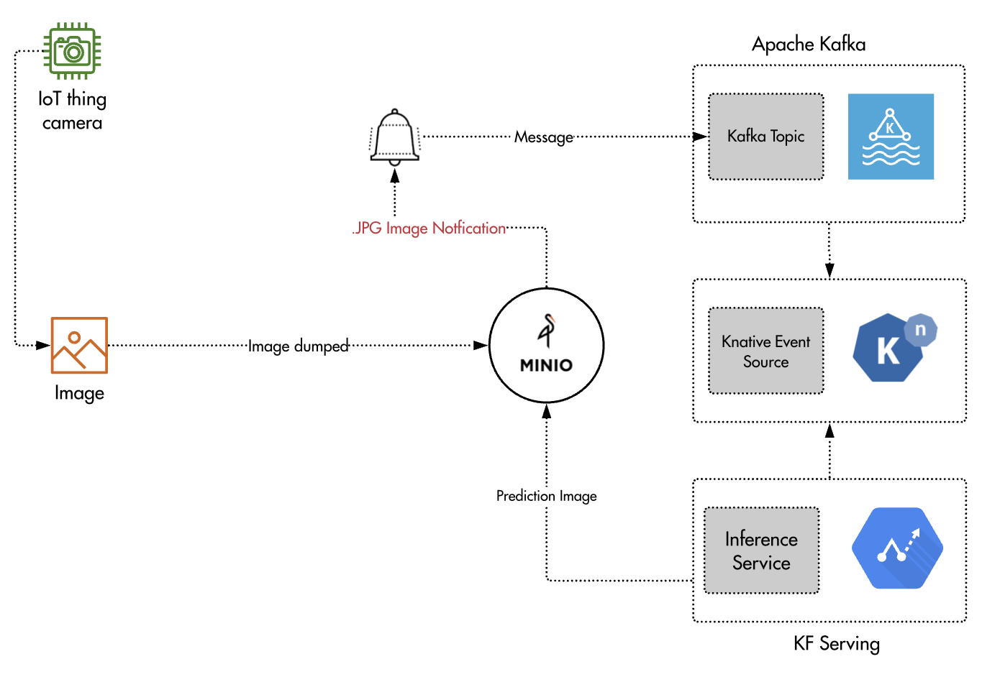
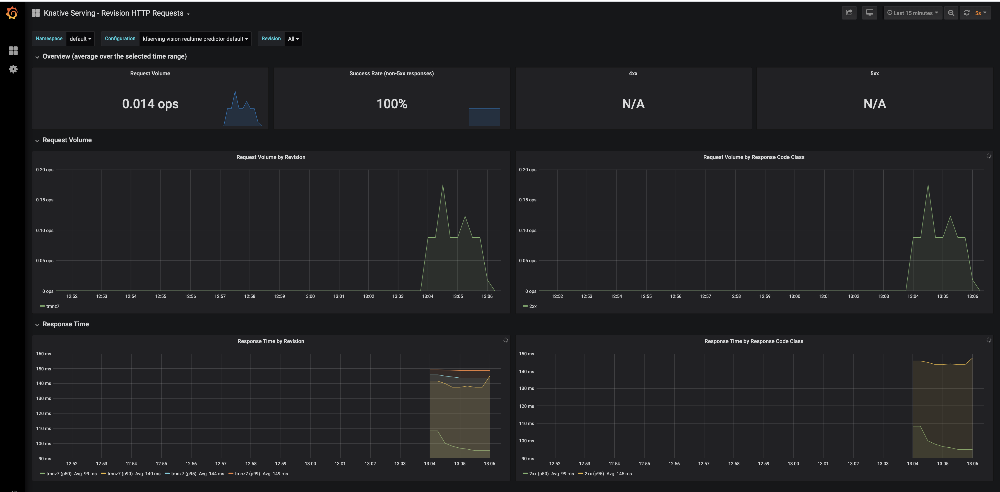

# Kubeflow Real time image classification with AutoML katib


##
[](https://www.linkedin.com/in/aniruddha-choudhury-5a34b511b/)

## ⚡ Technologies


<code>Kubeflow</code>

## Setup
1. Your ~/.kube/config should point to a cluster with [KFServing installed](https://github.com/kubeflow/kfserving/#install-kfserving).
2. Your cluster's Istio Ingress gateway must be [network accessible](https://istio.io/latest/docs/tasks/traffic-management/ingress/ingress-control/).
3. Install Minio with following Minio deploy step.
4. Use existing Kafka cluster or install Kafka on your cluster with [Confluent helm chart](https://www.confluent.io/blog/getting-started-apache-kafka-kubernetes/).
5. Install [Kafka Event Source](https://github.com/knative-sandbox/eventing-kafka/tree/main/pkg/source).
6. Kubernetes 1.18+
7. KFServing 0.5+


## Building Real time Image classification with Kubeflow Orchestrator 


## Deploy Kafka
If you do not have an existing kafka cluster, you can run the following commands to install in-cluster kafka using [helm3](https://helm.sh)
with persistence turned off.

```
helm repo add confluentinc https://confluentinc.github.io/cp-helm-charts/
helm repo update
helm install my-kafka -f values.yaml --set cp-schema-registry.enabled=false,cp-kafka-rest.enabled=false,cp-kafka-connect.enabled=false confluentinc/cp-helm-charts
```

after successful install you are expected to see the running kafka cluster
```bash
NAME                      READY   STATUS    RESTARTS   AGE
my-kafka-cp-kafka-0       2/2     Running   0          126m
my-kafka-cp-kafka-1       2/2     Running   1          126m
my-kafka-cp-kafka-2       2/2     Running   0          126m
my-kafka-cp-zookeeper-0   2/2     Running   0          127m
```

## Install Knative Eventing and Kafka Event Source
- Install [Knative Eventing Core >= 0.18](https://knative.dev/docs/install/any-kubernetes-cluster/#installing-the-eventing-component)
- Install [Kafka Event Source](https://github.com/knative-sandbox/eventing-kafka/releases).
- Install `InferenceService` addressable cluster role

```
VERSION=v0.23.0
kubectl apply --selector knative.dev/crd-install=true --filename https://github.com/knative/eventing/releases/download/$VERSION/eventing-crds.yaml
kubectl apply -f https://github.com/knative/eventing/releases/download/$VERSION/eventing-core.yaml
kubectl apply --filename https://github.com/knative/eventing/releases/download/$VERSION/eventing.yaml
kubectl apply -f https://storage.googleapis.com/knative-releases/eventing-contrib/latest/kafka-source.yaml
```

```bash
kubectl apply -f addressable-resolver.yaml
```

### KAFKA
```
kubectl apply -f kafka-client.yaml
kubectl exec -it kafka-client -- /bin/bash
kafka-topics --zookeeper my-kafka-cp-zookeeper-headless:2181  --list
kafka-topics --zookeeper my-kafka-cp-zookeeper-headless:2181 --topic realtime --create --partitions 1 --replication-factor 1 --if-not-exists
kafka-console-consumer --bootstrap-server my-kafka-cp-kafka-headless:9092 --topic realtime --from-beginning --timeout-ms 4000 --max-messages 5 

```

## Deploy Minio
- If you do not have Minio setup in your cluster, you can run following command to install Minio test instance.
```bash
cd pipeline/MINIO
kubectl apply -f minio.yaml
```

- Install Minio client [mc](https://docs.min.io/docs/minio-client-complete-guide)

### MINIO

```
kubectl port-forward svc/minio-service -n default 9000:9000

mc config host add myminio http://127.0.0.1:9000 minio minio123

mc mb myminio/rawimage
mc mb myminio/imageprediction

- Setup event notification to publish events to kafka.
mc admin config set myminio notify_kafka:1 tls_skip_verify="off"  queue_dir="" queue_limit="0" sasl="off" sasl_password="" sasl_username="" tls_client_auth="0" tls="off" client_tls_cert="" client_tls_key="" brokers="my-kafka-cp-kafka-headless:9092" topic="realtime" version=""

# Restart minio
mc admin service restart myminio

# Setup event notification when putting images to the bucket
mc event add myminio/rawimage arn:minio:sqs:us-east-1:1:kafka -p --event put --suffix .jpg
```

## Create the InferenceService

Specify the built image on `Transformer` spec and apply the inference service CRD.
```bash
cd pipeline/SERVING
kubectl apply -f minio_serving.yaml 
```

## Create kafka event source
Apply kafka event source which creates the kafka consumer pod to pull the events from kafka and deliver to inference service.
```bash
kubectl apply -f kafka-source.yaml
```
This creates the kafka source pod which consumers the events from `realtime` topic
```bash
kafkasource-kafka-source-3d809fe2-1267-11ea-99d0-42010af00zbn5h   1/1     Running   0          8h
```
## Upload a flower image to Minio RawImage bucket
The last step is to upload the image `images/flower.jpg`, image then should be moved to the classified bucket based on the prediction response!
```bash
mc cp images/flower.jpg myminio/rawimage
```
## Launch grafana dashboard

### Knative Monitoring
```bash
#create namespace
kubectl create namespace knative-monitoring
#setup monitoring components
kubectl apply  --filename https://github.com/knative/serving/releases/download/v0.13.0/monitoring-metrics-prometheus.yaml
```

```bash
# use port-forcd warding
kubectl port-forward --namespace knative-monitoring $(kubectl get pod --namespace knative-monitoring --selector="app=grafana" --output jsonpath='{.items[0].metadata.name}') 8080:3000
```

