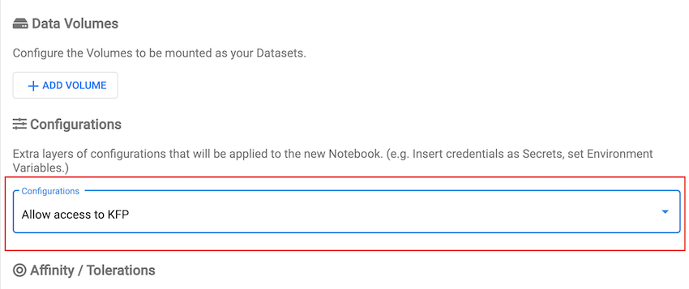

# Using Katib with Kubeflow Pipelines

The following examples show how to use Katib with
[Kubeflow Pipelines](https://github.com/kubeflow/pipelines). You have to install
Katib version >= 0.10 and Kubeflow Pipelines >= 1.6 to perform these examples.

You can find the Katib Component source code for Kubeflow Pipelines
[here](https://github.com/kubeflow/pipelines/tree/master/components/kubeflow/katib-launcher).

## Multi-user Kubeflow Pipelines setup

These Pipelines run in multi-user mode and your Kubeflow Notebook must have
the appropriate `PodDefault` with `pipelines.kubeflow.org` audience.

Follow these steps before creating Kubeflow Notebook to give the access to Pipelines:

1. Deploy this `PodDefault`

   ```yaml
   apiVersion: kubeflow.org/v1alpha1
   kind: PodDefault
   metadata:
     name: access-kf-pipeline
     namespace: kubeflow-user-example-com
   spec:
     desc: Allow access to KFP
     selector:
       matchLabels:
         access-kf-pipeline: "true"
     volumeMounts:
       - mountPath: /var/run/secrets/kubeflow/pipelines
         name: volume-kf-pipeline-token
         readOnly: true
     volumes:
       - name: volume-kf-pipeline-token
         projected:
           sources:
             - serviceAccountToken:
                 path: token
                 expirationSeconds: 7200
                 audience: pipelines.kubeflow.org
     env:
       - name: KF_PIPELINES_SA_TOKEN_PATH
         value: /var/run/secrets/kubeflow/pipelines/token
   ```

1. Select the appropriate configuration to attach above `PodDefault` to the Notebook.

   

## List of Examples

Here is the list.
